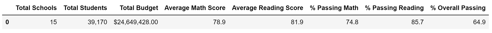

# School District Analysis

## Overview
The school board has discovered evidence of academic dishonesty; specifically, the reading and math grades for Thomas High School ninth graders appear to have been altered. Although the school board does not know the full extent of the academic dishonesty, they want to uphold state-testing standards and have turned to our team for help. We have been tasked with replacing the math and reading scores for Thomas High School with 'NaNs' while keeping the rest of the data intact. Upon replacing the math and reading scores, we will repeat the school district analysis which will allow us to see how the clean data compares to the original data.

## Results
 - The following sections of the district summary were affected: Average Math Score, % Passing Math, % Passing Reading, and % Overall Passing.  Average Math decreased by 0.1, % Passing Math decreased by 0.2%, % Passing Reading decreased by 0.1%, and % Overall Passing decreased by 0.3%. 
 ### District Data
 #### Original District Data
 
 #### Revised District Data
 .
 - The only section of the school summary affected was the Thomas High School line as we removed the Thomas High School 9th Grade math and reading scores.
 - Replacing the 9th graders’ math and reading scores significantly affected Thomas High School’s performance relative to the other schools. Upon removing the 9th grade scores and re-running that data, the % Passing Math, % Passing Reading, and % Overall Passing drastically decreased as follows:
   - % Passing Math decreased from 93.3% to 66.9%
   - % Passing Reading decreased from 97.3% to 69.7%
   - % Overall Passing decreased from 90.9% to 65.1%
 - Replacing the ninth-grade scores affected the following:
   - The math and reading scores for 10th, 11th, and 12th grade were unaffected.  However, the 9th grade scores were affected as that is the grade level from which the Thomas High School scores were removed.
   - Scores by school spending was slightly affected in the $630-644 spending range across the board for the Average Scores and % Passing.
   - Scores by school size was slightly affected in the Medium (1000-2000) range.  The before and after results are as follows:
     - Average Math Score decreased from 83.37 to 83.36
     - Average Reading Score increased from 83.86 to 83.87
     - % Passing Math decreased from 93.59% to 93.58%
     - % Passing Reading decreased from 96.79% to 96.73%
     - % Overall Passing decreased from 90.62% to 90.56%
    - The scores by Charter School Type decreased slightly in each category. The District School Type results stayed the same.  
    ### School Type
    #### Original School Type Data
    
    #### Revised School Type Data
    
## Summary
There were four major changes in the updated school district analysis after the reading and math scores for the 9th grade at Thomas High School were replaced with NaNs.
The largest change was the peformance of Thomas High School relative to the other schools, with each % category (Math, Reading, and Overall Passing) dropping over 20% once the 9th grade scores of Thomas High School were removed. Since Thomas High School is a Charter School, the data was affected for that School Type in all categories.  Similarly, the schools in the spending range of $630-644, of which Thomas High School is a part, revealed decreases in each category due to the 9th grade Thomas High School data removal.  Finally, the data in the Medium (1000-2000) School Size range, of which Thomas High School is a part, also was affected by tht 9th grade data removal.
